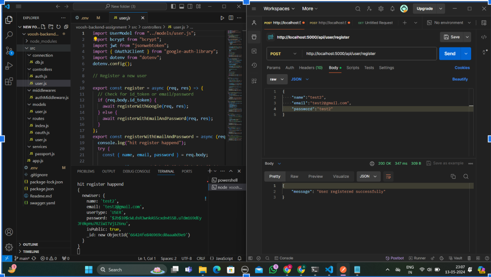
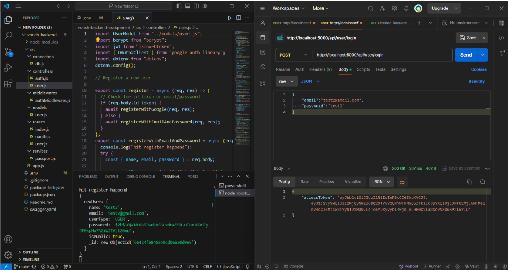
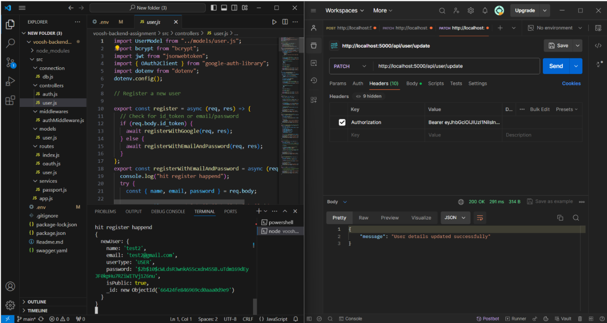
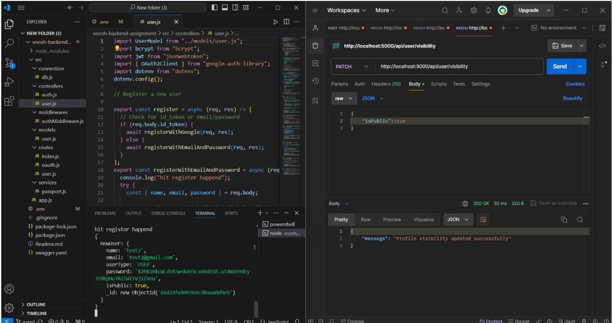
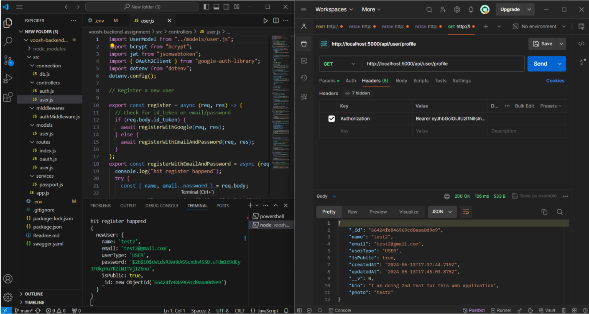
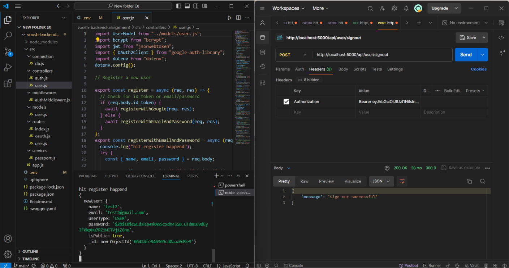

# Voosh Backend Application

Backend application developed for the Voosh backend assignment. 

### Installation

1. Clone the repository:

   ```bash
   git clone https://github.com/Abhay-86/Voosh.git

2. Install dependencies:

   ```bash
   cd voosh
   npm install
   ```

### Running the Application

1. Set up environment variables:

   - For your ease , env will be provided in the github repo itself.

2. Start the server:

   ```bash
   npm start
   ```

   This will start the server using nodemon, which automatically restarts the server when changes are detected.

   ### register API



### login API with authentication



### Update API of user details



### Alter Visiblity API



### API for USER data with but with differnet ADMIN permission



### Sign out API



## Admin creds
This is an Admin credential that can access all user profiles, whether they are public or private.

 email : Abhay@iitbhilai.ac.in
 password : Abhay@123 

## Endpoints

 base url - /api

## Endpoints

| Endpoint              | Description                                    | Authentication Required |
|-----------------------|------------------------------------------------|--------------------------|
| `/user/register`      | Register a new user.                           | No                       |
| `/user/login`         | Login an existing user.                        | No                       |
| `/user/update`        | Update user details.                           | Yes                      |
| `/user/visibility`    | Update profile visibility.                     | Yes                      |
| `/user/profile`       | Get user profile.                              | Yes                      |
| `/user/profiles`      | Get all profiles.                              | Yes                      |
| `/user/signout`       | Sign out.                                      | Yes                      |

